Atlas Demo已经具备了一个小型app的基本框架，本demo中主要展示了Atlas的主客户端、业务bundle、业务bundle独有library、中间件library、远程bundle、公共bundle、闪屏等特性。

## 工程导入

Atlas Demo地址https://github.com/alibaba/atlas/tree/master/atlas-demo/AtlasDemo 。git等安装详情不表。
Atlas Demo基于gradle，使用Android Studio打开。Android开发环境搭建详情不表。
需要注意的是Atlas是基于gradle的最新版本3.3的，如果没有安装gradle 3.3的用户使用Android Studio第一次启动会卡住，这里建议在使用Android Studio启动之前可以先在终端使用

  `./gradlew build`
  
编译工程，如果等待时间依旧过长，可以选择以下两种方式：

1. 翻墙（推荐）。因为Atals Demo除了gradle还需要其他一下远程资源。

2. 手动下载gradle-3.3-all.zip，拷贝到相应的grdle安装目录（mac默认为/Users/<用户名>/.gradle/wrapper/dists目录，Windows默认为C:\Users\计算机名.gradle\wrapper\dists目录）。

## 工程框架

我们从几个方面结合起来共同来看Atlas Demo的工程框架，也会大家开发更为复杂的APP提供帮助。

## 工程目录

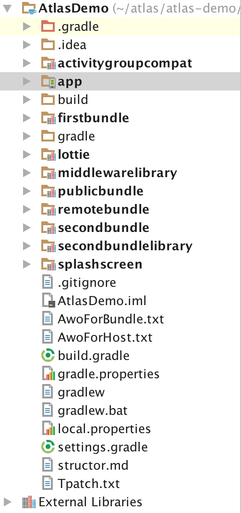

app目录：主客户端代码

firstbundle目录：第一个业务bundle代码

secondbundle目录：第二个业务bundle代码

secondbundlelibrary目录：第二个业务bundle单独依赖的library代码

remotebundle目录：远程bundle代码（远程bundle在APK发布时不会编译进APK内，而是在客户端使用时下载后加载）

publicbundle目录：公共bundle代码（不会打入主dex）

middlewarelibrary目录：中间件library（会打入主dex）

splashscreen目录：闪屏代码

lottie目录：splahscreen的依赖代码

activitygroupcompat目录：实现展示bundle 内的Fragment，因为bundle只通过Component的方式可以被依赖安装

## strutor.md

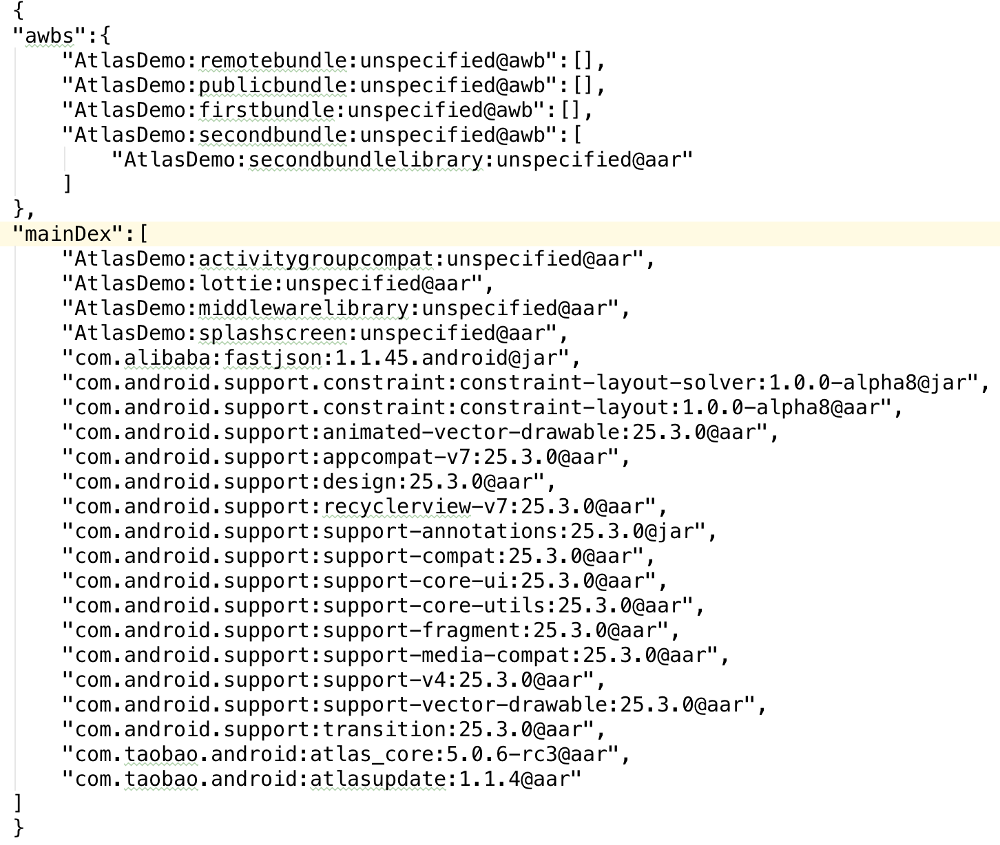

Atlas Demo作者也在structor.md里面列出了demo的依赖关系，其中**mainDex指的是会被编译进主dex的依赖**；awbs指的是各个bundle，它们将以**so文件的形式放在APK的lib文件夹**下（这些个so文件其实就是各个业务bundle的独立APK，只不过这个APK可能要依赖容器里面的中间件代码才能运行，只是后缀改成了so而已），从awbs中也可以看出secondbundlelibrary只被secondbundle依赖。

## app/build.gradle

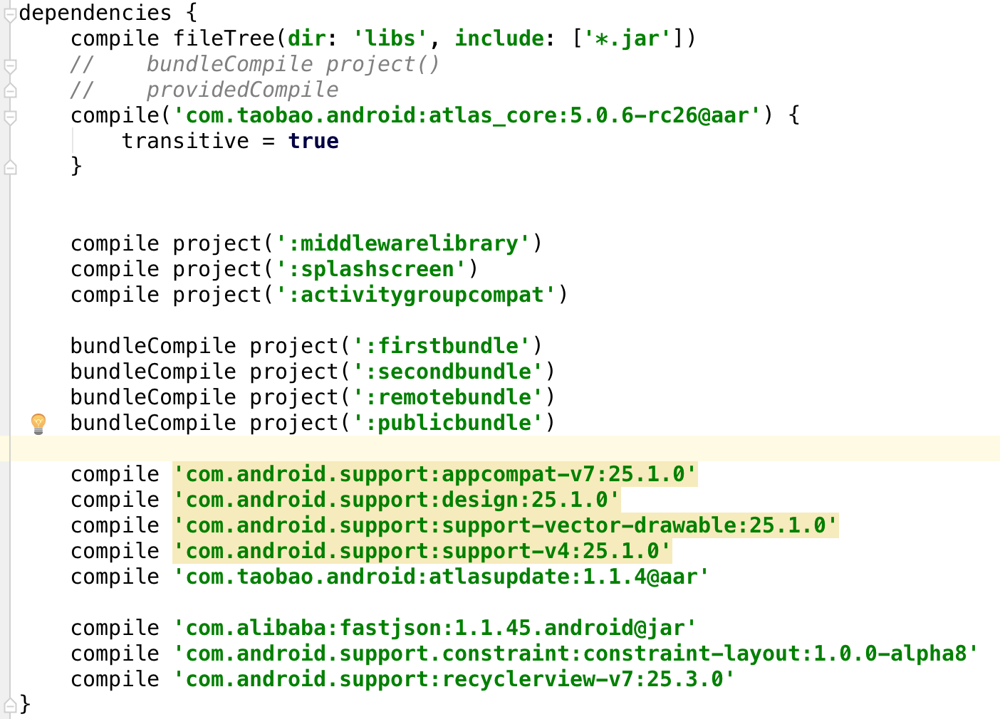

我们再来看下主客户端的build.gradle代码，如上图所示，从中可以看到业务bundle都是使用Atlas自定义的编译方法**bundleCompile**来进行依赖，其余需要编译进主dex的依赖都是使用原生**compile**命令进行依赖，如果只是provided依赖则使用**providedCompile**,使用atlas功能的主客户端代码需要依赖atlasplugin、atlas_core和atlasupdate。

## APK解压后的文件目录（构建APK参见“主APK构建”章节）

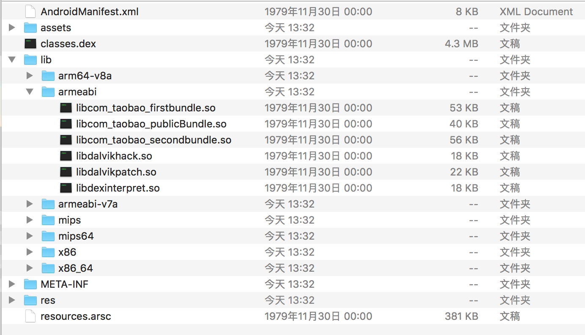

通过解压编译出来的APK我们也可以发现firstbundle，secondbundle，publicbundle是以so包的形式放在了lib/armeabi目录下面，注意这里并没有remotebundle的so文件，remotebundle的加载方式将在下文介绍。strutor.md中mainDex下的bundle都编译进了class.dex中。

## Activity跳转关系

Atlas Demo里面的Activity分布比较散，为了方便大家的快速入手，这里简单介绍下个Activity的跳转关系。

## WelcomeActivity

splashscreen bundle是会被编译进主dex里面的，从spllashscreen的manifest文件（splashscreen/src/main/AndroidManifest.xml）我们可以看到，WelcomeActivity是接收“android.intent.action.MAIN”和“android.intent.category.LAUNCHER”的Activity，WelcomeActivity是APP的入口Activity。
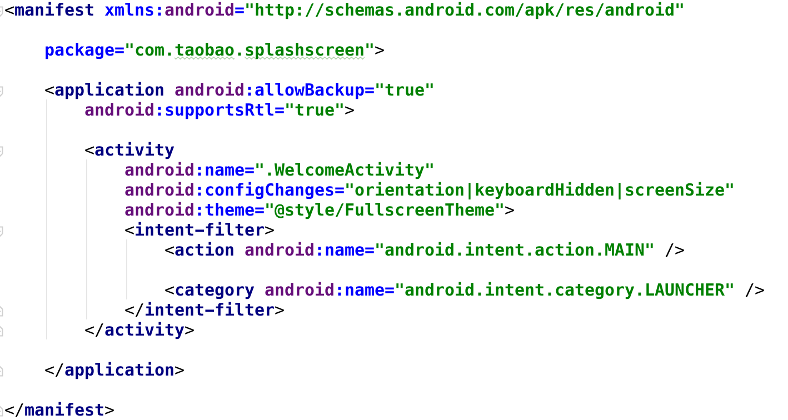

## WelcomeActivity->MainActivity

在WelcomeActivity.java（splashscreen目录）中的onPostCreate通过startActivity跳转到APP的首页MainActivity（app目录）。
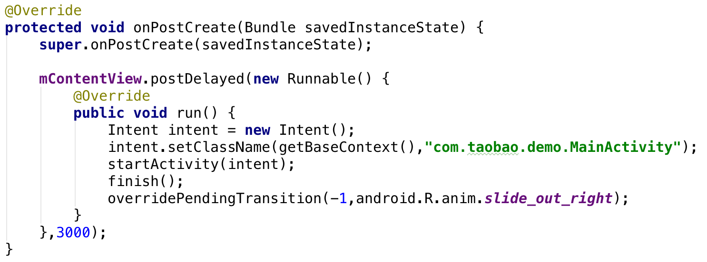

## MainActivity->FirstBundleActivity

MainActivity其实是个壳子Activity，在其onCreate函数中我们可以看到它其实是默认加载了firstbundle的FirstBundleActivity，并设置了导航栏，关于导航栏的具体实现细节大家可以参考activitygroupcompat bundle。
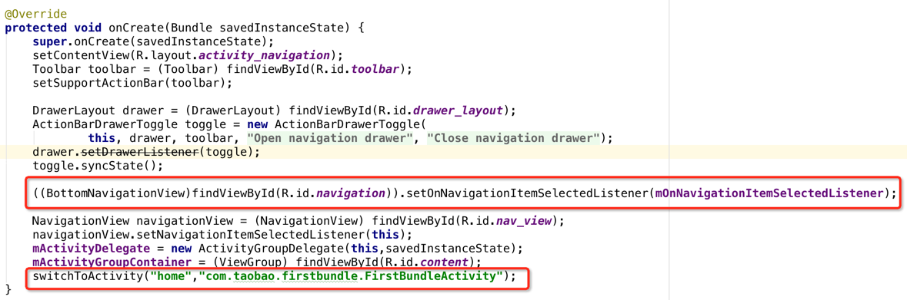

## MainActivity->FirstBundleActivity、MainActivity->SecondBundleActivity

通过导航栏我们可以实现在FirstBundleActivity和SecondBundleActivity之间进行跳转，FirstBundleActivity和SecondBundleActivity是属于不同的bundle，通过这种方式我们就实现了不同bundle的Activity在同一个APP中的展示。
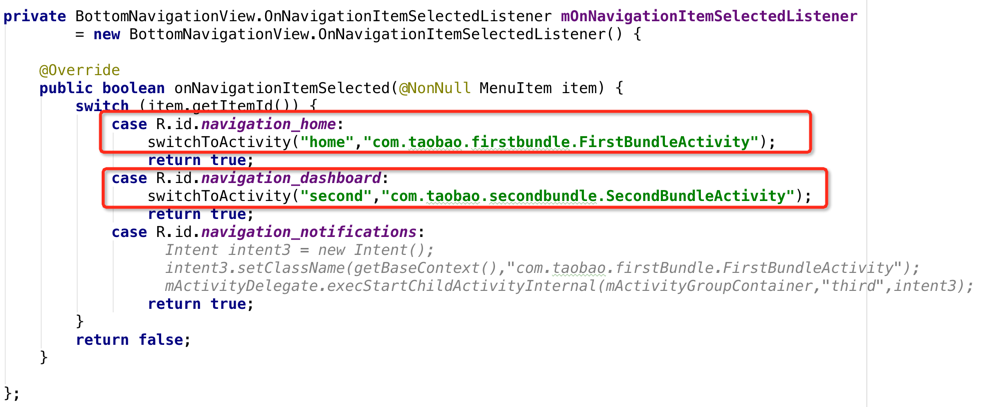

## 场景构建

Atlas Demo里面集成了主APK构建、动态部署构建、远程bundle构建等功能，下面我们进行单独介绍。

## 问题1：如何构建一个APK，发布到各个应用市场？

### 主APK构建步骤：

1. Atlas Demo中将主客户端代码和所有bundle都放在了一个工程下面，这也符合gradle工程的标准框架格式。

2. 各个业务bundle可以根据业务需求修改更新各自bundle的代码。然后再通过修改app/build.gradle中的version = getEnvValue("versionName", "1.0.0");来修改版本号，版本号默认为1.0.0。
3. 然后再在app目录下面执行`../gradlew clean assembleDebug publish`命令从而进行APK打包，生成的APK文件目录是app/build/outputs/apk/app-debug.apk，上述命令也会将该目录下的ap文件发布到仓库以便于后续生成patch。
4. 如果有手机连接在pc上可以直接使用adb install安装上述APK，在app目录下执行`adb install app/build/outputs/apk/app-debug.apk`。

## 问题2：如何在用户无感知的情况下，实现所有业务模块的独立动态更新？

### 动态部署（patch）构建步骤：

1. 各个业务bundle可以根据业务需求修改更新各自bundle的代码。

2. app工程目录下执行`../gradlew clean assembleDebug -DapVersion=apVersion -DversionName=newVersion`, 其中apVersion为之前打的完整APK的版本，newVersion为此次动态部署要生成的新的版本号。
这里举一个简单的例子，例如“主APK构建”步骤的APK版本是1.0.0，然后我简单更新firstbundle的string.xml里面的hello_blank_fragment属性为“this is fragment of firstBundle”，然后执行`../gradlew clean assembleDebug -DapVersion=1.0.0 -DversionName=1.0.1`。
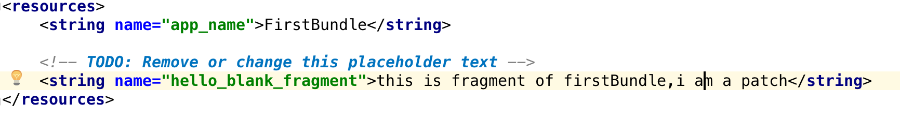

3. 检查build/output/tpatch-debug 目录下文件是否生成，将远程patch下载到你的设备上（主动下载和被动推送都可以，这里直接在PC上执行下面的命令(以下为mac下的命令，windows请修改文件分隔符)：
   ` adb push build/outputs/tpatch-debug/update.json /sdcard/Android/data/com.taobao.demo/cache/update.json`
   ` adb push build/outputs/tpatch-debug/patch-*.tpatch /sdcard/Android/data/com.taobao.demo/cache`
4. 打开Demo侧边栏，点击“动态部署模拟”，页面红色按钮执行动态部署，等待几秒钟之后APP会关闭此时说明动态部署已经成功，重启APP后就会发现自己改动的代码已经更新成功。
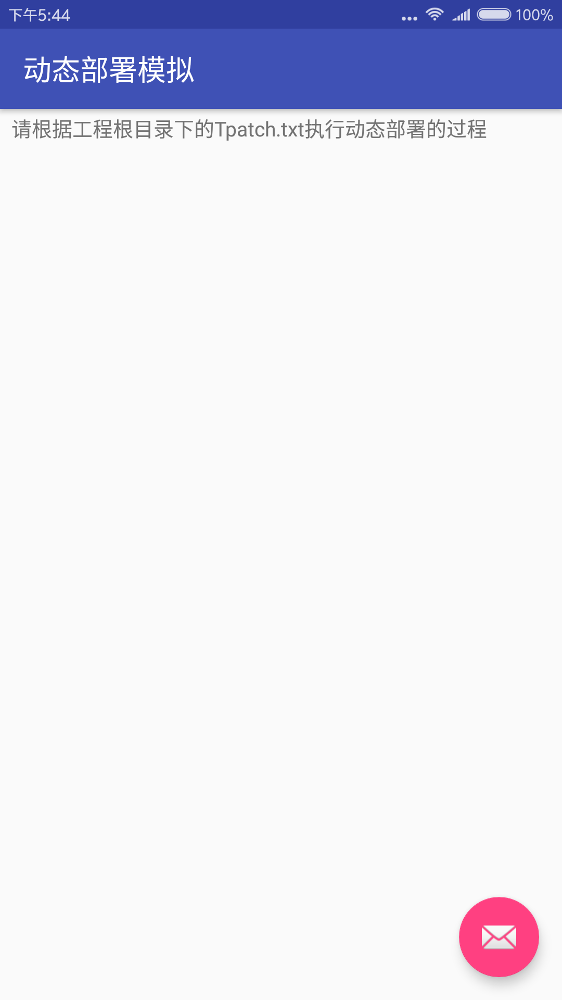  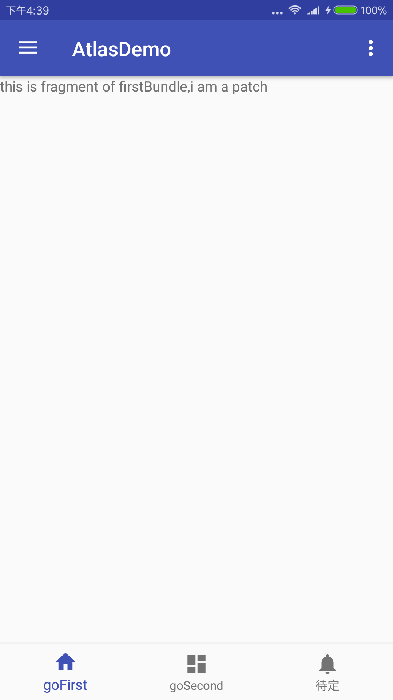

5. 感兴趣的同学可以研究下update.json和tpatch文件
6. 动态部署的主要优势：摆脱版本迭代周期限制，新增需求灵活发布；降低版本频繁发布给用户带来困扰；发现问题及时回滚；短时间内更高的覆盖率

## 问题3：如果在APK发布时，我不想把某个bundle编译进APK，而是在客户端使用时下载后加载，该怎么办？

### 远程bundle构建步骤：

1. 添加远程bundle的依赖，参考 app/build.gradle下的 `bundleCompile project(':remotebundle')` ，
2. 声明远程bundle列表，参考 app/build.gradle下的`atlas { tBuildConfig { outOfApkBundles = ['remotebundle'] }`。
3. 构建完整包，在app目录下执行`../gradlew clean assembleDebug publish`，远程bundle 路径：app/build/outputs/remote-bundles-debug。
4. 将远程so下载到你的设备上（主动下载和被动推送都可以），这里直接在PC上执行`adb push app/build/outputs/remote-bundles-debug/libcom_taobao_remotebunle.so /sdcard/Android/data/com.taobao.demo/cache/libcom_taobao_remotebunle.so`。
5. 打开Demo侧边栏，点击“远程组件模拟”，点击“加载远程bundle”，加载成功后就会跳到remotebundle的页面。

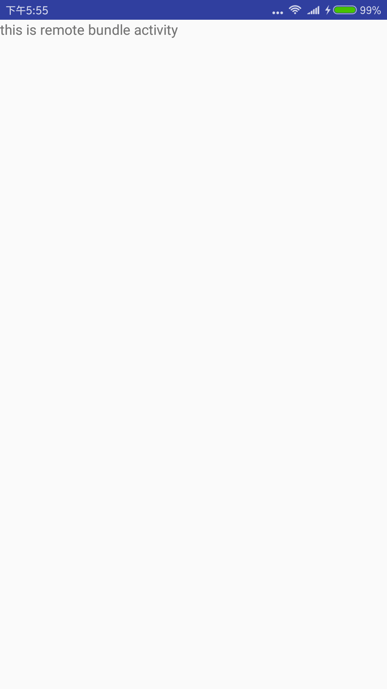

## 调试工具

### 单bundle调试（供线下调试使用，当只更改了单个bundle的代码时，无需对整个APP进行动态部署，可以一键进行单bundle的部署调试）

1. 在设备上安装APP，设备ADB连接电脑成功。
2. 修改一个bundle工程的代码或者资源（设置生效的标识）。
例如，我们这里在firstbundle中的FirstBundleActivity的onCreate的中加一个Toast提示，如下
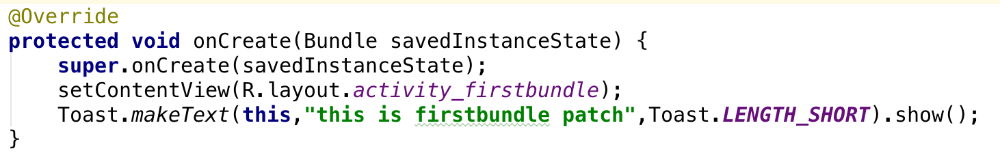
3. bundle工程的目录下执行`../gradlew clean assemblePatchDebug`，然后等应用重启或者应用关闭后点击重启")就可以看到代码生效。
根据上述改动，我们在firstbundle的目录下执行`../gradlew clean assemblePatchDebug`，然后就可以看到客户端重启，Toast提示生效。

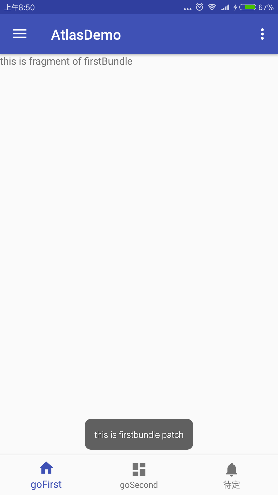
