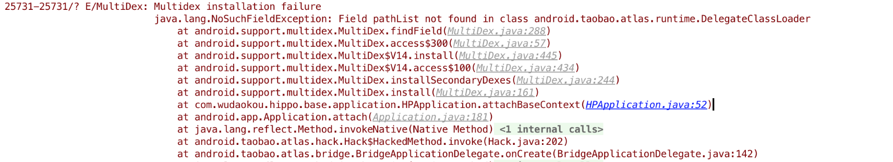
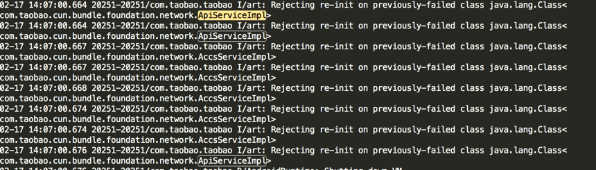

# 常见问题
**有任何的建议和问题请在github上提issue给我们，我们会尽快回复，同时高频的会更新的FAQ文档中**

* **需要去除的原生multidex初始化**
   
   Atlas容器内部集成了multidex的dex安装功能，所以原先multidex的初始化代码可以省略，也不需要添加multidex的三方库依赖，需要使用multidex的只需要build.gradle内部将multidex置为enable即可（Atlas内部集成该内容一方面是便于和容器的兼容，另一方面后续容器会优化原生multidex在dalvik上面的性能）

>

* **ClassNotFoundException**
  
  1. Bundle如果相互依赖，则构建起需要配置dependency，否则运行期会无法找到被依赖bundle内的class，且不支持为了查找性能，目前不支持二级依赖：比如A->B->C,如果A没有显式声明依赖C，则A bundle里面无法直接使用bundle C里面的Class，检查bundle依赖是否成功配置可以通过反编译Apk的主dex 查看**android.taobao.atlas.framework.FrameworkProperties**的field bundleInfo的内容，里面记录了所有bundle的依赖关系
  2. 通过LayoutInflater 膨化xml，则xml里面如果有richview，则务必确保LayoutInflater持有的context的classloader可以load到该richview，假设context来自于A bundle的Activity，而xml来自于B bundle，如果A和B没有依赖关系，那么加载也肯定失败

* **NoClassDefFoundError**
  
  造成该问题的原因比较多，排查步骤第一个先检查Exception的源头是不是ClassNotFoundException，然后反编译排查类确实是否存在；
  
  如果类本身存在，需要往前排查系统的警告信息，比如在Art的设备上会有class被reject的warning信息：
    >

   在dalvik的系统上，则会带有VFY tag的警告信息：
       >

 一般来说，由于ART设备警告的信息报在dex2oat的时候，所以往往与发生crash时的Exception信息相隔比较远，所以通常遇到该类问题，dalivk的设备拿来排查可能更能发现问题的原因。另外noclassdef造成的原有接口类找不到，方法丢失，方法参数不匹配，方法属性变更，混淆等，所以具体原因需要利用上述warning信息并对照反编译的代码去排查根本的原因   
