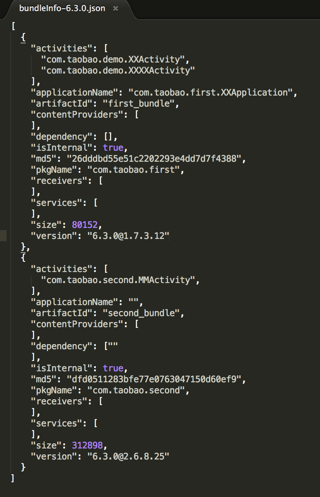

    # 主工程容器接入
Atlas开源的代码内容主要包括以下几个模块：

1. 基于gradle的构建插件（包括修改过的aapt内容）；
2.	android端测容器运行库atlas_core；
3. 基于容器提供更新能力的库atlas_update;

我们比较倾向于用一个比较干净的壳子工程来作为容器架构下的打包工程，这个工程建议只存在AndroidManifest.xml和构建的文件及部分资源内容，manifest文件用于单独管理apk的icon，版本号，versioncode等；构建文件管理版本依赖；这里我们取名打包工程等名字为apk_builder;
通常情况下Apk_builder除了主Apk的AndroidManifest.xml之外，接入Atlas后，Main_builder将会包含以下内容：

1. **build.gradle** : 用于配置主apk的依赖及控制构建参数
2. **packageIdFile.properties**: 配置bundle的packageId,以保证资源段独立（也可以通过mtl.tBuildConfig.autoPackageId设置自动分配packageID）
3. **bundleBaseInfoFile.json**: 配置bundle的依赖关系

下面会逐个说明每个文件的使用和注意要点

## build.gradle(AtlasGradlePlugin)
支持 atlas 工程打包的gradle 插件， 基于 google 官方的 android builder （2.0.0~2.1.0）

1. 引用插件及依赖仓库

		buildscript {
		    repositories {
		        mavenLocal()
		        jcenter()
		    }
		    dependencies {
		        classpath "com.taobao.android:atlasplugin:1.0.1"
		    }
		}
		repositories {
    		jcenter()
		}
		
	注意尽量不要指定 classpath "com.android.tools.build:gradle"的版本，默认使用的是 2.1

2. 应用plugin

		apply plugin: 'com.taobao.atlas.application'
		//注意不能同时 apply com.android.application

3. 添加运行库依赖	
	    
	    dependencies {
       	compile('com.taobao.android:atlas_core:5.0.0@aar') {
        	transitive = true
    	}
        compile 'com.taobao.android:atlasupdate:1.0.8@aar'
        
	**如果不需要用到atlas的动态部署功能，不需要依赖atlasupdate**    
	
4. 开启atlas容器功能
    
         atlas {
         	atlasEnabled true
    	   tBuildConfig {
        		autoStartBundles =['com.taobao.firstbundle'] //自启动bundle配置
			}

         	patchConfigs{
        		debug {
            	createTPatch true
        		}
  		  	}
       		 buildTypes {
        		debug {
            		if (apVersion){
          		  		baseApDependency  "com.taobao.android.atlasdemo:AP-debug:${apVersion}@ap"
            			patchConfig    patchConfigs.debug
            			}
        			}
	 			}
  		  }   

	**atlasEnable字段需要指定为true才能开启打包阶段的基于容器扩展的task**    
	
   **后续两个设置用语动态部署打包时的开关设置，其余字段参考配置列表中的使用方式**

5. 构建
	1. APK构建 **./gradlew assembleDebug 或者 assembleRelease**
	
    	构建产物：

		1. build/outputs/apk/xx.apk , 构建的产物apk   
		2. build/outputs/apk/xx.ap , 构建的基线包， 里面包含 apk 和其他的打包中间配置
		3. build/outputs/dependencyTree-debug.json , 整个工程的依赖树
		4. build/outputs/atlasConfig.json , 整个打包的 atlas 配置参数
	2. TPatch构建 **./gradlew clean assembleDebug -DapVersion=1.0.0 -DversionName=1.0.1**
	
		apVersion表示被动态部署应用的基线版本，versionName表示动态部署后新的versionName

		构建产物：
		除了依赖树和配置参数之外，额外的产物有：
		1. build/outputs/tpatch-debug , debug 包 patch产物
		2. build/outputs/tpatch-release , release 包 patch产物
	

### 配置

#### 配置列表

 功能  | 配置名称 |  类型 | 值
 ------------- | ------------- | ------------- | -------------
是否启用atlas  | mtl.atlasEnabled | boolean  | true
自动生成bundle的packageId  | mtl.tBuildConfig.autoPackageId | boolean  | true
预处理manifest， 如果开启atlas，必须为true  | mtl.tBuildConfig.preProcessManifest | Boolean  | true
使用自定义的aapt， 如果开启atlas，必须为true  | mtl.tBuildConfig.useCustomAapt | Boolean  | true
aapt输出的R为常量, 建议值设置为false， 可以减少动态部署的patch包大小  | mtl.tBuildConfig.aaptConstantId | Boolean  | false
合并jar中的资源文件  | mtl.tBuildConfig.mergeJavaRes | Boolean  | false
构建基线包，建议开启，否则后面的patch包无法进行  | mtl.tBuildConfig.createAP | Boolean  | true
合并bundle jar中的资源文件  | mtl.tBuildConfig.mergeAwbJavaRes | Boolean  | false
自启动的bundle列表， 值是 packageName  | mtl.tBuildConfig.autoStartBundles | List  | [com.taobao.firstbundle]
提前执行的方法，格式是 className:methodName|className2:methodName2 ， 注意class和methodname都不能混淆，且方法实现是 class.method(Context)  | mtl.tBuildConfig.preLaunch | String  |
 基线的依赖坐标， 如： com.taobao.android:taobao-android-release:6.3.0-SNAPSHOT@ap   | mtl.buildTypes.debug.baseApDependency | String  | null
 基线的依赖坐标， 如： com.taobao.android:taobao-android-release:6.3.0-SNAPSHOT@ap   | mtl.buildTypes.release.baseApDependency | String  | null
使用atlas的application，包含 atlas基础初始化及multidex逻辑  | mtl.manifestOptions.replaceApplication | boolean  | true
 打andfix patch 包   | mtl.patchConfigs.debug.createAPatch | boolean  | false
 打动态部署 patch 包   | mtl.patchConfigs.debug.createTPatch | boolean  | true
 andfix 打包过滤 class 列表文件   | mtl.patchConfigs.debug.filterFile | File  | null
 andfix 打包过滤 class 列表文件   | mtl.patchConfigs.debug.filterClasses | Set  | []
 打andfix patch 包   | mtl.patchConfigs.release.createAPatch | boolean  | false
 打动态部署 patch 包   | mtl.patchConfigs.release.createTPatch | boolean  | false
 andfix 打包过滤 class 列表文件   | mtl.patchConfigs.release.filterFile | File  | null
 andfix 打包过滤 class 列表文件   | mtl.patchConfigs.release.filterClasses | Set  | []

####  最简配置

    atlas {
        atlasEnabled true
    }

具体参考 `atlas-demo/app/build.gradle`

## packageIdFile.properties
每个bundle在生成的时候，需要为其分配独立的packageId，用以使其保证每个bundle的资源ID全局唯一；资源ID的可分配区间为**[0x21,0x7f)**,0x1x为系统保留，0x7f为主apk使用，0x20之前的发现miui里面内部已使用，所以目前我没选择这个区间作为bundle的packageId分配区间
书写的格式为：**groupId:artificatId=XX**（如下图）

## bundleBaseInfoFile.json
bundleBaseInfoFile 是一个JSON格式的文件，里面记录bundle的信息以及依赖关系，**dependency**字段用于标识该bundle所依赖的bundle，如果A依赖B，B依赖C，则触发的Abundle安装时，实际的安装顺序为C->B->A,**JSONArrary中每个item的key为该bundle的artificatID,dependency里面的item为被依赖的bundle的packageName**
>

