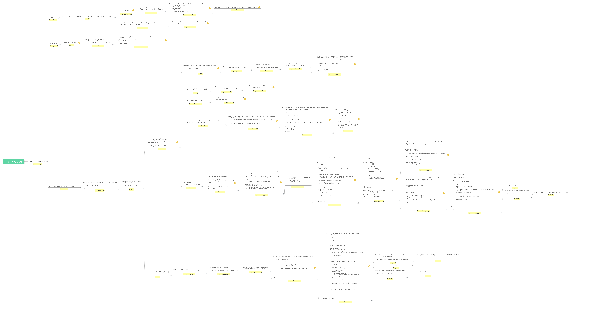
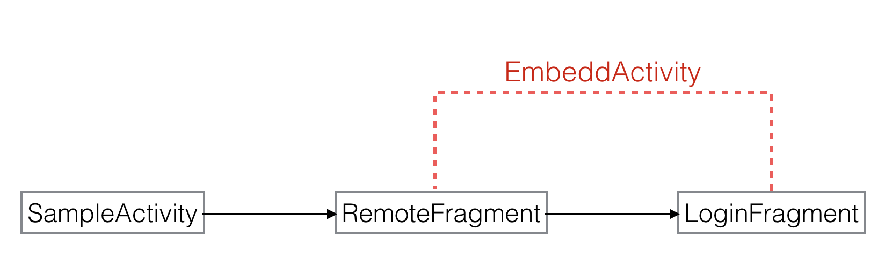
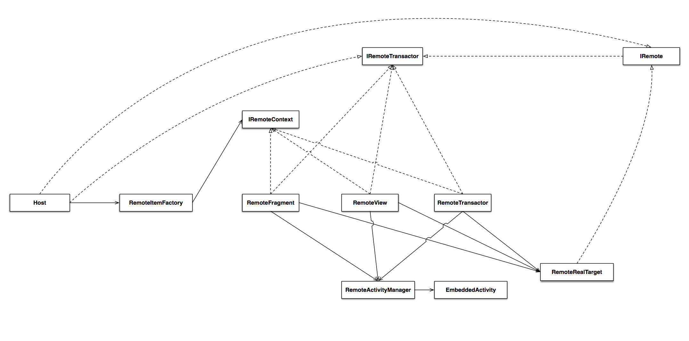

# Android跨ClassLoader的模块之间互相通信的几种方式

## 现状
Atlas作为java层以OSGI规范进行组件化解耦的容器。在一定层度上清晰了各个模块之间的边界，便于各个业务以内聚的方式不断的演化更新。

但是在复杂的App比如手淘这种无数个业务交织的场景下，完全的隔离也给业务的开发造成了不小的成本。针对这种问题，目前主要解决的方案有：

1. 参照多个App之间通信的方式，使用AIDL可以作为组件之间进行一定层度通信的方式。
2. 使用基于容器的实现开发的ServiceHub，跟AIDL一样将接口放到公共Library，然后ServiceHub中写入接口和实现的对应关系。使用方通过ServiceHub得到接口实现进行使用。

## 缺陷
AIDL、ServiceHub解决了部分bundle之间通信或者代码复用的问题。但是这两者也存在着很大的不足。一方面AIDL限制了只能传递parcel以及简单对象，对于UI复用比如说Richview的重用则完全行不通，同时使用成本也是ServiceHub的机制的一个痛点，业务方需要提前将新的接口提前注册到ServiceHub。
## 新的机制
新的组件之间的重用及通信策略延续了AIDL免注册的方式，同时解决了跨classloader情况下UI复用的问题。新的方式将重用类型归为RemoteFragment、RemoteView、RemoteTransaction三种类型。

### RemoteFragment
RemoteFragment适用于某个Bundle中有公共的Fragment要提供给一个或者多个其他业务bundle使用的情况，比如说在手淘里面，SkuFragment(sku选择界面)可能会提供给详情，购物车，聚划算等多个业务使用；或者在某些App里面，登录界面也以LoginFragment的方式提供给Bundle按需使用。

1. 使用方式
 1. 代码改动：以LoginFragment为例，LoginBundle需要在自己的LoginFragment做一定的改动
	  	  
	 ```
	 public class LoginFragment extends Fragment implements IRemote{


		    @Override
		    public Bundle call(String commandName, Bundle args, IResponse callback) {
		        return null;
		    }
		
		    @Override
		    public <T> T getRemoteInterface(Class<T> interfaceClass,Bundle args) {
		        return null;
		    }
}
```
	
		LoginFragment 需要在原来的基础上实现IRemote接口，IRemote来自Atlas容器的内部实现，暂时还未从容器中拆分出差，这也意味着业务方需要增加对atlas的依赖。**IRemote实现的两个接口会在文章后面解释**


 
   	2. Bundle的AndroidManifest.xml中进行注册
   	
   		```
   		<manifest xmlns:android="http://schemas.android.com/apk/res/android"
    	package="com.taobao.login">
			<application>
	       		<meta-data android:name="atlas.fragment.intent.action.LOGIN"
	       		 	android:value="com.taobao.login.LoginFragment" />
			</application>
		</manifest>
   		```
	Remote组件参照AIDL的方式在manifest中进行注册。查找时以meta-data的name做key进行查找，RemoteFragment的key必须以**atlas.fragment.intent.action.**开头。

	3. 使用方如何调用RemoteFragment
		
		```
		public class SampleActivity extends FragmentActivity{
			public void doLogin(){
		        Intent loginIntent = new Intent("atlas.fragment.intent.action.LOGIN");
		        RemoteFactory.requestRemote(RemoteFragment.class,loginIntent, 
		        	new RemoteFactory.OnRemoteStateListener<RemoteFragment>() {
		            @Override
		            public void onRemotePrepared(RemoteFragment fragment) {
		                getSupportFragmentManager().beginTransaction().add(R.id.container,fragment).commit();
		            }
					@Override
		            public void onFailed(String errorInfo) {
		                // Redirect to h5 login or downgrade
		            }
		        });
		    }
}
		```
		业务使用方调用Atlas的RemoteFactory的接口进行request，由于期间可能涉及到bundle的安装，所以整个过程采用callback的方式。获取到RemoteFragment的句柄后直接进行操作即可。**建议Fragment里面涉及到的交互功能等的代码封装在Fragment内部**，比如说LoginFragment里面所有按钮的点击以及异常处理全都Fragment内部进行实现。这样的话两个Bundle之间的边界也更清晰。
> 问题：RemoteFragment 如何通知外部登录成功或者失败，除了用系统的广播等机制，能否基于Remote的机制更直接地方便地实现该功能呢？后续RemoteTransaction中会阐述具体的用法。

2. 实现的机制
	先附一张网上摘录的Fragment启动图，不清楚的同学可以通过这个大致了解整个Fragment启动的一些方法调用，理清Fragment和Activity在启动时的一些交织的关系(图片可能需要下载放大了观看)。
	
	RemoteFragment本身也是真正意义上的Fragment，所以可以用来直接被FragmentManager或者FragmentTransaction直接进行管理；同时它也是真正的LoginFragment的在使用方的代理。他们之间的关系如下：
		
	使用者应该了解RemoteFragment机制的以下几个特点，明白其内部实现的主要机制：
		
	* RemoteFragment的使用方拿到的仅仅是目标fragment的代理，所以真正的实现对使用方来说是不可见的。如果除了拿到Fragment展示之外还有其他的接口需要暴露给使用者，则需要走**Remote的通信机制**。
	* EmbeddActivity才是真正目标Fragment实例化所需要的context，EmbeddActivity是由RemoteFragment初始化时创建的Activity，用于给目标Fragment初始化UI，它是真正的Activity，但是没有界面，同时也没有有效的WindowManager，涉及到Window操作的会自动转交给SampleActivity进行处理。EmbeddActivity是bundle之间不需要依赖直接使用UI最根本的保证。
	
	  >设想一下，如果一个Activity引用了5个来自不同Bundle的RemoteFragment，那么相当于这个Activity内嵌了5个EmbeddActivity；那如果引用了5个来自同一个Bundle的RemoteFragment呢？
	
	* 目标Fragment与SampleActivity之间还是保持完整的隔离，所以目标Fragment也无法获取宿主的引用，所以如果目标Fragment需要与SampleActivity发生通信，则也要遵循**Remote的通信机制**
	
	
### RemoteView
与RemoteFragment 类似，RemoteView提供更细粒度的bundle间的UI复用。

1. 使用方式
	1. 代码改动
	
		```
		public class SampleRichView extends FrameLayout implements IRemote{
			@Override
		    public Bundle call(String commandName, Bundle args, IResponse callback) {
		        return null;
		    }
			@Override
		    public <T> T getRemoteInterface(Class<T> interfaceClass,Bundle args) {
		        return null;
		    }
}
		```
	2. AndroidManifest修改，RemoteView的key以**atlas.view.intent.action.**开头

		```
   		<manifest xmlns:android="http://schemas.android.com/apk/res/android"
				package="com.taobao.sample">
			<application>
	       		<meta-data android:name="atlas.fragment.intent.action.SAMPLE_RICH"
	       		 	android:value="com.taobao.sample.SampleRichView" />
			</application>
		</manifest>
   		```
   	3. 使用方如何调用RemoteView
   		
   		```
		public class SampleActivity extends Activity{
			public void inflateRemoteView(FrameLayout container){
		        Intent sIntent = new Intent("atlas.view.intent.action.SAMPLE_RICH");
		        RemoteFactory.requestRemote(RemoteView.class, sIntent, 
		        	new RemoteFactory.OnRemoteStateListener<RemoteView>() {
		            @Override
		            public void onRemotePrepared(RemoteView remoteView) {
		                ViewGroup.LayoutParams params = new FrameLayout.LayoutParams(ViewGroup.LayoutParams.WRAP_CONTENT,ViewGroup.LayoutParams.WRAP_CONTENT);
		                container.addView(remoteView,params);
		            }
					@Override
		            public void onFailed(String errorInfo) {
		                // downgrade
		            }
		        });
		    }
}
		```
2. 实现机制

	RemoteView与RemoteFragment实现基本一致，需要EmbeddedActivity作为真正View膨化的基本条件，RemoteView本身只是一个FrameLayout，就像DecorView，目标View作为子View添加在里面。当然这个机制也有一定的隐患，**使用方不要通过findViewByID或者getChildAt等viewGroup的public 方法尝试获取目标view并进行操作，RemoteView应该被当做View而不是ViewGroup，与目标View的通信应该通过Remote的机制进行**
	
###RemoteTransact
RemoteTransact相当于是RemoteView或者RemoteFragment的简化版，仅仅为了bundle和bundle之间的通信而存在，它和RemoteView，RemoteFragment都实现了IRemoteTransact接口。可以通过下面的草图了解大致的关系：

以RemoteTransactor为例，他和目标Transactor类都实现了IRemoteTransactor，所以当使用方调用IRemoteTransactor的接口时候，Remote对象将方法路由到目标对象的方法上。

使用者可以通过这两个方法与真正的远端对象进行通信：

```
public Bundle call(String commandName, Bundle args, IResponse callback)
```
* 以命令的方式通知目标对象，如果是异步返回，则远端通过传入的callback接口进行回调，如果不是，则直接返回，适用于使用方和远端存在简单通信的情况。

```
public <T> T getRemoteInterface(Class<T> interfaceClass,Bundle args)
```
* 远端本身已经有封装过具体的接口，则可以实现getRemoteInterface返回具体的接口的实现。这种方式类似之前的AIDL的方式，前提是interface 类需要在两个bundle均可访问的主apk或者公共bundle中。

这种使用方式适用于本身具有特定接口定义的SDK中，比如在手淘里面的windvane和weex。

以windvane为例（sample里面windvane的接口只做范例，与真实的使用接口可能存在差异）：存在很多Bundle需要提供JSPlugin的场景。原生的Windvane需要提前注册JSPlugin，这种方式对bundle而言开销较大。需要bundle提前启动注册以避免后期运行时无法找到js函数对应的native方法。
假设在Remote机制下则Windvane针对非内部的common native方法有一个ExternalJSMethodExecuter，当需要执行非内部的js方法时，则可以通过externalJSMethodExecuter.execute()查找外部的method。（这种也适用于Weex等SDK在非常规的Apk内由外部实现定制的适配器）

假设bundle A有若干个native方法，需要提供给JS使用，则可以写成

```
public class MyJSPluginManager implements IRemote{
    @Override
    public Bundle call(String commandName, Bundle args, IResponse callback) {
        return null;
    }

    @Override
    public <T> T getRemoteInterface(Class<T> interfaceClass,Bundle args) {
        if(interfaceClass == WVApiPlugin.class){
            if(args.getString("js_method").equals("funA")){
                return new FunAPlugin();
            }else if(args.getString("js_method").equals(funB)){
                return new FunBPlugin();
            }else{
                //unknow error
            }
        }
        return null;
    }
}
```
同时在Manifest中增加如下配置：

```
<meta-data android:name="atlas.transaction.intent.action.funA" android:value="com.taobao.sample.MyJSPluginManager" />
<meta-data android:name="atlas.transaction.intent.action.funB" android:value="com.taobao.sample.MyJSPluginManager" />
```
对于JS方法的调用方，则通过如下方法实现：

```
    public void execute(Activity activity, final String jsMethodName){
        RemoteFactory.requestRemote(RemoteTransactor.class,activity,new Intent(jsMethodName),new RemoteFactory.OnRemoteStateListener<RemoteTransactor>() {
            @Override
            public void onRemotePrepared(RemoteTransactor remote) {
                Bundle b = new Bundle();
                b.putString("js_method",jsMethodName);
                WVApiPlugin plugin  = remote.getRemoteInterface(WVApiPlugin.class,b);
                if(plugin!=null){
                    //方法仅供示例，与实际情况可能存在差异
                    plugin.execute(jsMethodName,...);
                }
            }
            @Override
            public void onFailed(String errorInfo) {

            }
        });
    }
```
> 这里requestRemote里面直接传入RemoteTransactor可能对开发者来说还有点晦涩，SDK开发者也可以尝试直接对RemoteTransactor以及IRemote进行封装，比如改造成更为直观的BaseJSManager和BaseJSPlugin

同样的，其他的SDK（比如weex）也可以通过类似方案在多classloader的APK内部实现自己定制的适配器，规避所有的接口实现需要预先注册的情况，同时也对整体应用的性能带来帮助。

###远端如何主动调用使用方的接口
我们也存在被使用方在某些场景下需要主动调用或者按规律定期callback宿主的情况，一种方式是使用宿主掉用远端时传进来的IResponse接口多次回调，但是如果涉及到复杂的情况就需要用到下面的方法：

宿主本身对于被调用方来说也是一个远端的对象，所以宿主自己可以使用IRemote，同时将自己注册给Remote对象，RemoteFragment、RemoteView、RemoteTransactor的基类IRemoteContext实现了提供了registerHostTransactor接口，在RemoteFactory回调时将自身的IRemote实现注册进去

```
    void registerHostTransactor(IRemote transactor);
```
那么在远端需要使用的时候，则可以通过HostTransactor（前面图中未标出）得到宿主的IRemote的实现并传递相应的信息。

```
	public static HostTransactor get(IRemote remoteItem)
```

###Remote机制的特点和不足
Remote机制本身强烈依托于组件化拆分的方案。它的解耦层度介于AIDL和直接依赖之间。相比AIDL灵活层度更高。不过代理的方式并不能完全杜绝通过非常规方法来获取远端目标对象来进行使用，另外也可能存在某些边缘方法无非被完全代理的情况，这也需要在以后的迭代中进行优化，对于非Atlas容器化但是使用了组件化拆解方案的App，这种思路也是同样适用的。

## 现在还可以选择的bundle间代码复用的方案
对于AIDL、serviceHub以及Remote的机制，可能还存在临时无法按照规范进行解耦的情况。目前除了静态依赖外，也可以考虑使用动态依赖的方式,用来解决在具体使用到某个功能时候再去挂载相应的依赖模块，不过**bundle依赖始终打破了bundle之间的边界，需要谨慎使用**

```
    /**
     * 设置bundle运行时依赖
     * @param source  需要添加依赖的bundle
     * @param dependencyBundle 被依赖的bundle的packagename
     * @param resourceDependencyNeed 是否需要使用被依赖bundle的资源
     * @throws BundleException
     */
    public void requestRuntimeDependency(ClassLoader source,String dependencyBundle,boolean resourceDependencyNeed) throws BundleException{
```


##其他：由于native so的相互调用导致的bundle依赖
Native Library 在多classloader运行机制下，需要事先了解几个要点：

1. 定义同一个So的依据是全路径完全相同且so内容相同
2. 调用LoadLibrary(或者load)在native真正dlopen library之前java层会先findLibrary，如果是系统库，则在系统环境变量里面包含的路径内，如果是外部引入的，则通过ClassLoader.findLibrary进行查找，BundleClassLoader的查找逻辑是先找自身bundle安装目录下的，找不到接着找依赖bundle内的，最后去找主dex也就是PatchClassLoader的findLibrary去查找。

	如果是直接使用dlopen bundle内的so，则需要传入so的全路径（比如说通过java层获取），否则可能出现so 找不到。

3. native so load时与load该so的类所在的classloader存在绑定关系，如果存在native反调java层代码的情况，则只能调用到够找到该classloader可以找到的java类的方法
4. 在android 7.0版本之前native so load同一个进程空间下只可load一次，如果同一个classloder第二次去load则直接返回成功，如果不同的classloader去load则会失败；android 7.0以后ClassLoader通过namespace各自独立，不同的ClassLoader可以去load同一个so，分别会在各自的namespace有各自的mmap，可以通过/proc/pid/maps 查看各自的map信息

### native特殊使用情况及建议 
1. 由于不同bundle的java代码使用相同的So导致的依赖：

	建议把调用相关的调用So的代码和So本身单独封装成一个公共的模块，否则如果存在So反调java的情况，则只能调用到loadLibrary的ClassLoader范围内的java类的代码
	
2. 由于native so依赖或者dlopen公共native So的情况：
	使用方案：
	
	1. 公共so下层到公共模块，同时提前load（规避7.0版本开始区分namespace隔离的情况），bundle的so使用的时候不能使用官方的dlopen接口，需要根据mapping查找已load so的导出函数进行使用,规避因为namespace不一致导致多份mmap的情况。 
	         
	

 

	