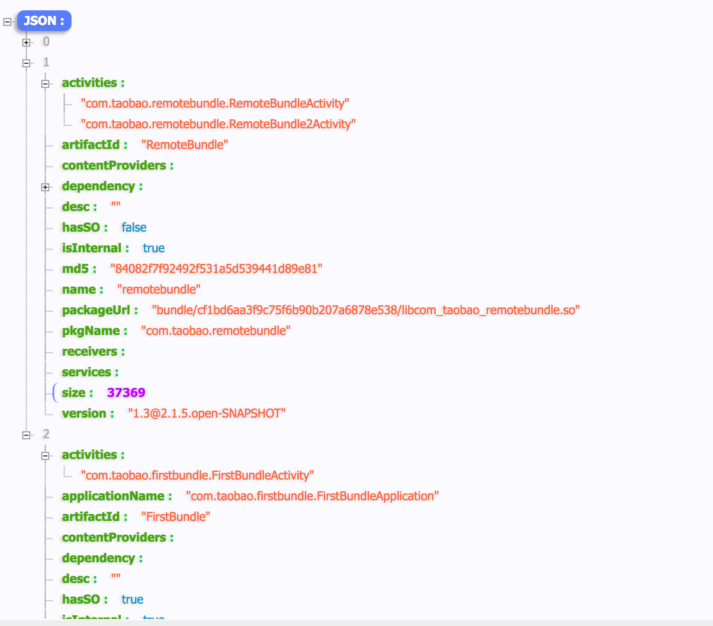

# APK结构

基于Atlas构建后的APK结构如下图，host与普通Apk无异，但是Manifest和assets会添加一些额外的内容，同时在armeabi目录中会增加若干个bundle构建的产物，取名为String.format(lib%s.so,packagename.replace(".","_"))；packagename为bundle的AndroidManifest中的packagename,这些so都是正常的apk结构，改为so放入lib目录只是为了安装时借用系统的能力从apk中解压出来，方便后续安装
>

##assets/bundleinfo-version.json
构建完的apk在host的assets目录下，会有个bundleinfo-verison.json的文件，其中version为manifest中的versinonname，里面记录了每个bundle大小，版本，名字以及里面所有的component信息，这些内容在构建的时候生成，基于这些信息每个bundle可以在component被触发的时候去按需的进行安装，整个过程对开发者透明（从中也可以看到默认情况下bundle对外暴露的只是基于Android原生的Activity，service，receiver等component）。
>

##AndroidManifest
bundleinfo的信息同时也会在构建后的主manifest里面体现，如线框1、2所示，每个component下面meta-datal里面记录该component所在的meta-data,同时bundle某些特有的信息会记录在application级别的meta-data里面。
>

