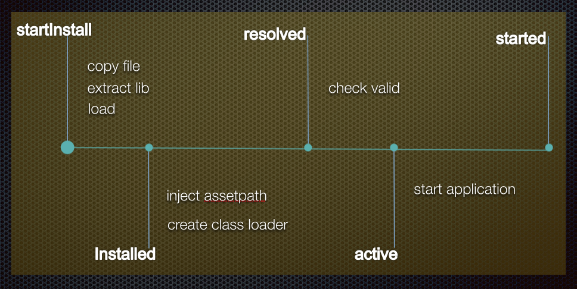

## 容器框架

>

如上图所示，atlas主要分为以下几个层级：

1. 最底下的hack工具层：
   包括了容器所需的所有系统层面的注入和hack的工具类初始化和校验，容器启动时先校验设备是否支持容器运行，不支持则采取降级并记录原因； 

2. Bundle Framework 负责bundle的安装 更新 操作以及管理整个bundle的生命周期；

3. runtime层：主要包括清单管理、版本管理、以及系统代理三大块，基于不同的触发点按需执行bundle的安装和加载；runtime层同时提供了开发期快速debug支持和监控两个功能模块。从Delegate层可以看到，最核心的两个代理点：一个是DelegateClassLoader：负责路由class加载到各个bundle内部，第二个是DelegateResource：负责资源查找时能够找到bundle内的资源；这是bundle能够真正运行起来的根本；其余的代理点均是为了保证在必要的时机按需加载起来目标bundle，让其可以被DelegateClassloader和DelegateResource使用

4. 对外接入层:AtlasBridgeApplication是atlas框架下apk的真正Application，在基于Atlas框架构建的过程中会替换原有manifest中的application，所以Atlas的接入并不存在任何初始化代码，构建脚本完成了接入的过程。AtlasBridgeApplication里面除了完成了Atlas的初始化功能，同时**内置了multidex的功能**，这样做的原因有两个：
   1. 很多大型的app不合理的初始化导致用multidex分包逻辑拆分的时候主dex的代码就有可能方法数超过65536，AtlasBridgeApplication与业务代码完全解耦，所以拆分上面只要保证atlas框架在主dex，其他代码无论怎么拆分都不会有问题；
   2. 如果不替换Application，那么atlas的初始化就会在application里面，由于基于Atlas的动态部署实际上是类替换的机制，那么这种机制就会必然存在包括Application及其import的class等部分代码在dalvik不支持部署的情况，这个在使用过程中造成一定成本，需要小心的使用以避免dalivk内部class resolve机制导致部分class没成功，替换以后该问题得到最好的解决，除atlas本身以外，所有业务代码均可以动态部署；
   
另外内置的原生的multidex在dalvik上面性能并不好，atlas内部对其进行了优化提高了在dalvik上面的体验。

除AtlasBridgeApplication之外，接入层对外提供了部分工具类，包括主动install bundle，start bundle，以及获取全局的application等各种功能。

## Bundle生命周期
每个bundle的生命周期如下图所示：
>

**Installed**	bundle被安装到storage目录

**Resolved**  classloader被创建，assetpatch注入DelegateResoucces

**Active**     bundle的安全校验通过；bundle的dex检测已经成功dexopt(or dex2oat)，resource已经成功注入

**Started**  bundle开始运行，bundle application的onCreate方法被调用

##  类加载机制

Atlas里面通常会创建了两种classLoader,第一个是DelegateClassLoader，他作为类查找的一个路由器而存在，本身并不负责真正类的加载；DelegateClassLoader启动时被atlas注入LoadedApk中，替换原有的PathClassLoader；第二个是BundleClassLoader，参考OSGI的实现，每个bundle resolve时会分配一个BundleClassLoader，负责该bundle的类加载。关系如下图所示：
**DelegateClassLoader以PathClassLoader为parent，同时在路由过程中能够找到所有bundle的classloader；**

**BundleClassLoader以BootClassLoader为parent，同时引用PathClassLoader,BundleClassLoader自身findClass的顺序为**
  
  **1. findOwn： 查找bundle dex 自身内部的class**
  
  **2. findDependency: 查找bundle依赖的bundle内的class**
  
  **3. findPath： 查找主apk中的class**

>

#### 范例
下图是容器中类加载的大致顺序；
可以认为是一个Bundle的Activity启动的类加载过程来帮助理解（假设Activity所在的bundle已经安装）；

1. ActivityThread从LoadedApk中获取classloader去load Activity Class；
2. 根据上面的classloader关系，先去parent里面加载class；
3. 由于class在bundle里面，所以pathclassloader内查找失败，接着delegateclassloader根据bundleinfo信息查找到classloader在bundle中（假设为bundleA）；
4. 从bundleA中加载class，并且创建class；
5. 后面在Activity起来后，如果bundleA对bundleB有依赖关系，那么如果用到了bundleB的class，又会根据bundlA的bundleClassloader的dependency去获取bundleB的classloader去加载；

##  资源加载机制
>

类似ClassLoader，LoadedApk中的Resources被替换成Atlas内部的DelegateResources,同时在每个Bundle安装的过程中，每个bundle的assetspath会被更新到DelegateResources的AssetsManager中；每个bundle的资源特征如图可知：

1. bundle构建过程中，每个bundle会被独立进行分区，packageId保证全局唯一，packageID在host的构建工程内会有个**packageIdFile.properties**进行统一分配；
2. 虽然每个bundle的manifest都声明了自己的packagename，但是在aapt过程中，arsc文件里面所有bundle的packagename均被统一为hostApk的package，比如在手淘内就都是com.taobao.taobao；这样改的目的是为了解决在资源查找中一些兼容性问题； 
