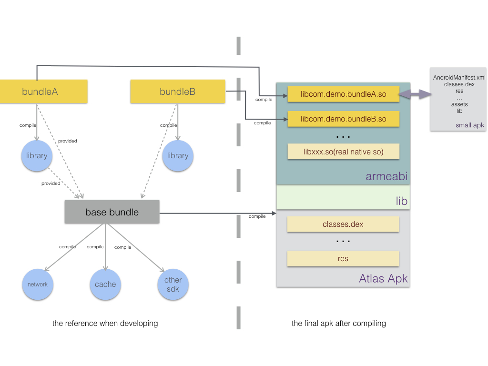

# Overview of Atlas Framework
Atlas provides a unique way to for code decoupling.It uses a new concept called bundle(just like bundle in osgi). A bundle module is similar to Android app module.It can almost include everything needed to build app. It become an small apk after compiling,at last compiling step we changed the Modify the extension name(.apk) of bundle to '.so' and stored it to the final shell apk. We usually called the shell apk **Base bundle** that contains other bundles 

**why we need bundle?**  A bundle means an independent individual and it has a clear boundary with other bundles. usually they dont have class reference with each other(except **public bundle**).for example:we can change the android library to bundle module which like search,detail,login and others that are no many reference. It is very useful for developing. And it will be helpful for upgrading later if one part of them wants to updating their code to a new version.

**How do they work?** When Atlas receives a request for a intent that matches certain component in a bundle,it will check if the bundle has been loaded and will load it if need. After that,Atlas delivery this request to system(Usually AMS), and the component will be started by system because ClassLoader and Resources has been hooked before.

>Android Instant Apps only work on Android devices running on Android 4.0 (API level 14) or higher.

##what's difference between bundle module and normal apk module

A bundle can almost include everything needed to build app. But also There are some defference between them.

1. **Classes:** while Default App module compile all dependencies together to classes.dex(or classes.dex->classesn.dex if multidex is used),In Atlas framework,every bundles has its own dependencies,And it's impossible that they have same compile dependencies between them. It means each class is unique in the entire Atlas Apk.

2. **Resources:** As you know,When compiling android resources, aapt will set packageID "0x7f" for default app while in bundle aapt will set a new distinct packageID for each bundle.These mechanism makes every resource item will be given an unique ID.

> There are more Difference between theme. such as a bundle module(not base) can not has resource items that are used in AndroidManifest.xml.for more detail you can see

The diagram below illustrates  the relationship between bundle and base bundle(**public bundle is not included in it**) 

##feature as bundles
The concept of bundle provide a new and unique way for developers to develop own feature module and for future updating. Before introducing thre core concepts of bundle of Atlas,We need to understand som foundational terminology.

At a very basic level,apps have at least one feature or things that they do:find a location on a map,send an email,or purchase for something you bought as examples.Many app provide multiple features.

For example.a electricity business app might allow users to seach a kind of commodity,see the detail info  to check if it is satisfactory or not, and at last purchasing for some of them. Each of those actions-searching,selecting,purchase - is a feature with in the app,

With Atlas apps,developers should only care about their own feature modules. For example,detail developers just need to know the input(maybe a commodity id) from the search feature,they use common sdks from base bundle(such as network,cache,base res and  so on) to develop their features. And delivery the output(for buy) to the purchase module. It's restricted for direct **Class reference** between each of them. In principle each bundle has no reference with each other. 
This concept of feature is very similar to the concept of **bundle** in **OSGI**,So we call these bundles for them. and later you will know how Atlas managing bundles in runtime, we follow the osgi specification on some strategy in classloading.

### what benefits does you can get from this strategy
**Reduced Complexity -** Developing with Atlas(OSGI) technology means developing bundles. Bundles are modules. They hide their internals from other bundles and communicate through well defined Intent. Hiding internals means more freedom to change later. This not only reduces the number of bugs,it also makes bundles simpler to develop.

**Reuse -** it's very easy to use many third party sdks from base bundle,and it makes easily for managing the versions of them. (Also Atlas uses a Unified specification for using public bundle)

**Dynamic update -**It's makes update 
With a smaller particle size. every bundle can be updated by itself and developer only need to assurance the output or the interface for external use is compatible with the old verison.

### what benefits does app users can get
As mentioned before, there are local bundles and remote bundles. for local bundels, there are a little performance loss on first loading because of bundle loading. And In fact,because of on-demand loading stratgy, Atlas enhance the experience on the device which ApiLevel < 19 if the app used multidex before. 
 According our test result,the impact is very small because we only load the bundle current needed. for remote bundle: users can use a single feature of an app without having to install the entire app with all its other features. When users request a feature from an Atlas app,they receive only the bundle necessary to run that specific feature. It's also reduce the storage cost on the device if you don't need these features.
 
> Each remote bundle within the atlas app should have at least one Activity that acts as the entry-point for that feature,And the feature's first use is starting activity,not service,receiver or provider.

##Bundle module and Bundle so
To provide this on-demand loading features,you need to break up your app into smaller modules and refactor them into bundle modules.

When you build an Atlas project, the build output is Atlas apk that contain one or more bundle sos. Each bundle so is built from a bundle module.

##How bundles used at runtime(for learning the internal of atlas)
To understanding this,you should know three key point in Atlas.

**DelegateClassLoader -** In normal android apk,system use PathClassLoader in loadedApk to load classes in dex. In atlas,every bundle has a BundleClassLoader for load it's own dex. At startup,atlas replace PathClassLoader with DelegateClassLoader. So when ActivityThread want't to load Class of certain bundle,DelegateClassLoader will delivery this request to target BundleClassLoader which return the right class.

The diagram below illustrates the relationship between classloaders

**BundleInfo -** How DelegateClassLoader can know which BundleClassLoader is the right? The bundleInfo is necessory. When compiling bundles, the build plugin parse bundle's AndroidManifest.xml, and store all its components name and other info to the FrameworkProperties.class that Atlas will generate bundle info from  
it at runtime. each bundleinfo item includes the bundle's size,md5,application-name,dependencies,all activity-name, service-name,receiver-name,provider-name and other necessory info.

**DelegateResources -** At runtime, every bundle share a public resources called DelegateResources. which will be updated or recreated(if apilevel<21) if a new bundle is loaded. So each resources can be get from DelegateResources,and the distinct package id between bundle and base bundle makes it's impossible there are duplicate resources id.

The diagram below illustrates the status of DelegateResources

